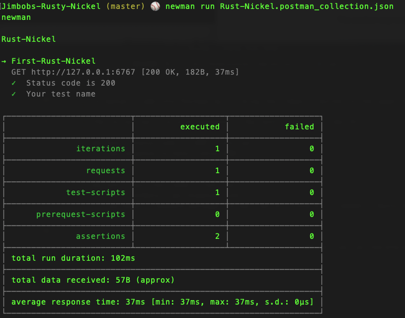

# Jimbob's Rust Nickel!


## Setting up Cargo
Cargo is a popular package manager for Rust projects.

Check if you have it installed with this command:
```
cargo --version
```

Enter the project directory:
```
cd jimbobs-rusty-nickel
```

Then, just run it:
```
cargo run
```

The endpoint can then be hit with a GET request at http://localhost:6767


## Try it with Postman!
The postman configuration file included here allows you to run Postman tests against your server.

To manually add into Postman by clicking the "Import" button in the upper left-hand corner and selecting the `.postman_collection.json` file.

The collection file also contains a few tests that look like this:
```
pm.test("Status code is 200", function () {
    pm.response.to.have.status(200);
});

pm.test("Your test name", function () {
    var jsonData = pm.response.json();
    pm.expect(jsonData.message).to.eql('Hello! Sincerely, Jimbob\'s Rusty Nickel');
});
```

These Postman tests can actually be run from the command line (as therefore, on CI servers) with the [newman](https://github.com/postmanlabs/newman) command line tool:

If you don't have `newman`, pelase install it:
```
npm install -g newman
```

Then the postman file can be executed like so:
```
newman run Rust-Nickel.postman_collection.json
```

Example output of running the postman tests via newman:




## Scaffolding

This project was scaffolded with:
```
cargo new jimbobs-rusty-nickel --bin
```

and a few modifications from this guide: https://nickel-org.github.io/getting-started.html
